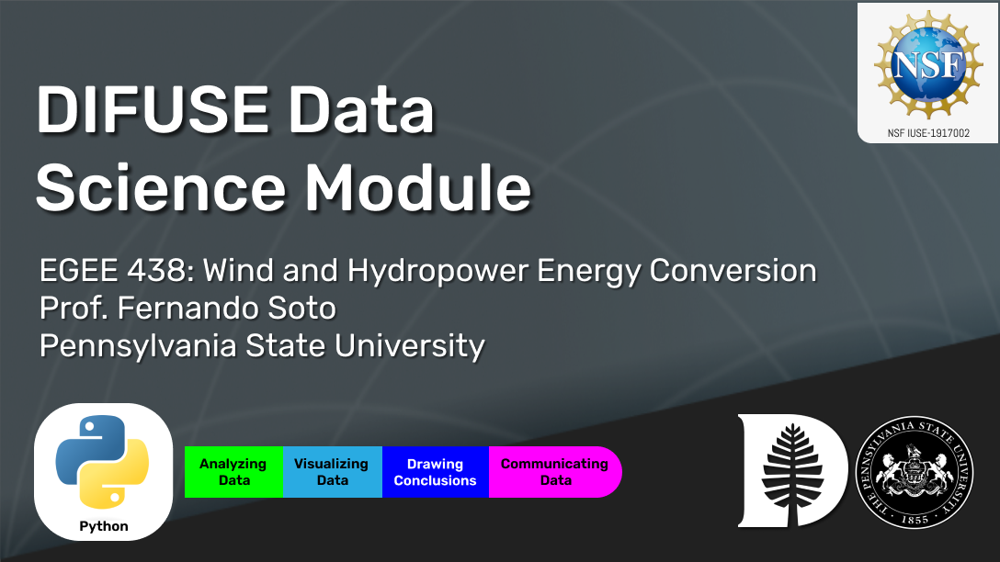

# Wind Speed Power Analysis DIFUSE Module 

## Contributors: Luis Hinojosa ('24), Muna Onuoha ('25), Logan Sankey ('20), Fernando Soto (Professor of Engineering), Petra Bonfert-Taylor (DIFUSE PI, Professor of Engineering), Lorie Loeb (DIFUSE PI, Professor of Computer Science), Taylor Hickey (Project Manager).

This module was developed through the DIFUSE project at Dartmouth College and funded by the National Science Foundation award IUSE-1917002.

 This work is licensed under a <a rel="license" href="http://creativecommons.org/licenses/by-sa/4.0/">Creative Commons Attribution-ShareAlike 4.0 International License</a>.

|| <a rel="license" href="http://creativecommons.org/licenses/by-sa/4.0/"> </a>This work is licensed under a <a rel="license" href="http://creativecommons.org/licenses/by-sa/4.0/">Creative Commons Attribution-ShareAlike 4.0 International License</a>. |
|---------|----------|

## Module Objective

Allow students to engage with the wind energy power equations and explore other considerations in the siting of a wind farm.

## Learning Objectives
1. Enable students to visualize the relationships between the wind speed variables and the wind power equations
2. Identify useful statistical methods in defining wind speed characteristics of a region
3. Use real wind speed and wind turbine data to determine potential vs. actual energy harvested
4. Recognise the complexity of the taken  considerations of building a wind farm

## Module Description 
Wind Engineers use various tools to predict the energy output from a particular location. This module introduces students to some of these tools such as the wind power equations, turbine design, and regional wind speed data. Over 3 blocks using Python in Google Colab, the module highlights the interconnected effects of these measurements and uses real world data and headlines to cement the techniques of choosing where to build a wind farm.

### Data
Data consists of regional wind speed data and turbine power curves collected from various sources.

### Platform
Students use Python in Google Colab to process and analyze the data.

## Schedule and Links

Use this page to get an idea of the timeline of the module, what components are involved, and what documents are related to each component. This is the schedule intended for module deployment by the DIFUSE team, though instructors are welcome to modify the timeline to fit their course environment.

| Date |  Assignment   | Description         | Files (Linked to Repository Contents) |
|------------------|-----------------|--------------------------------------------------|-------------------------------------------------|--------------------------------------------------|
| First Meeting | Deployment Documents | Contains information for students and instructor to set up Google Colab
 |[Setup Instructions](completed_module\logistics) |
| Class 1| Block 1: The Wind Power Equations | Students are introduced to the wind power equations and the relationships between them.
 |[Block 1](completed_module\components\Block1_Wind_Equations.ipynb) |
| Class 2 | Block 2: Some Statistical Concepts | Students will review statistical measures (mean, median, frequency) that quantify real wind speed data sets from various regions.
 |[Block 2](completed_module\components\Block2_StatisticalConcepts) |
| Class 3 | Block 3: Wind Power Production in Real Life | Students will observe wind turbines and their capacity for power production. Wind farm siting considerations are also highlighted. |[Block 3](completed_module\components\Block3_RealWorld.ipynb) |

## Course Information
[Wind and Hydropower Energy Conversion](https://www.e-education.psu.edu/egee438/) is a course offered at Penn State University that examines the principles of sustainability and renewable energy conversion with emphasis on wind and hydro energy resources. This module was designed for students with minimal experience with coding and data science, but familiarity with calculus. This module is also recommmended for majors in Environmental Engineering and Energy Engineering.

|| <a rel="license" href="http://creativecommons.org/licenses/by-sa/4.0/"> </a>This work is licensed under a <a rel="license" href="http://creativecommons.org/licenses/by-sa/4.0/">Creative Commons Attribution-ShareAlike 4.0 International License</a>. |
|---------|----------|